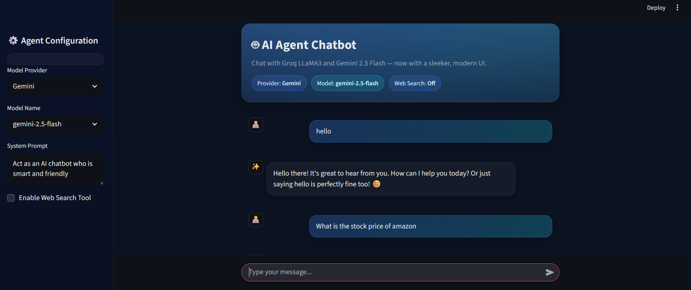
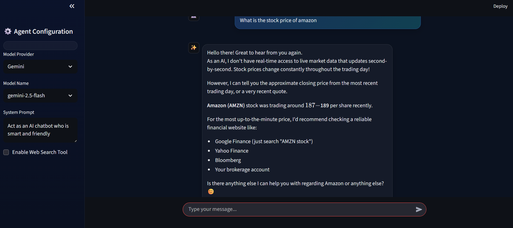
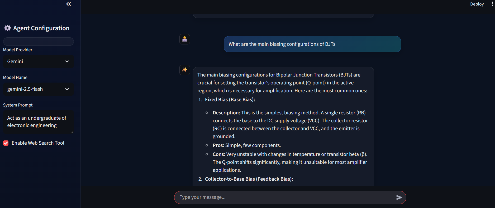

# PersonalAgenticChatbot

A minimal **agentic chat UI** built with **Streamlit** (frontend) and a **FastAPI** backend that proxies requests to LLM providers (e.g., **Groq** and **Gemini**) with an optional **web search** tool.

> This README is written so a new user can clone the repo and get the app running end-to-end.

---

## ✨ Features

- 🔁 Chat UI with message history (Streamlit)
- 🧩 Pluggable providers: **Groq** (LLaMA 3) and **Gemini**
- 🌐 Optional web search tool (toggle in UI)
- 🎨 Frontend Streamlit 
- ⚡ FastAPI backend at `POST /chat` returning JSON

---

## 📦 Requirements

- **Python** 3.10 or newer  
- **pip** (bundled with Python)
- (Optional) **Git** to clone the repository
- Create a file with .env and include follwing
#### LLM provider keys
GROQ_API_KEY=your_groq_key_here
GEMINI_API_KEY=your_gemini_key_here

#### Web search provider (if used)
TALVI_API_KEY=your_talvi_key_here

#### Create & activate a virtual environment
python -m venv myenv

Windows (PowerShell)
.\myenv\Scripts\Activate.ps1 

## Install all requirements
pip install -r requirements.txt

## Start the backend
(in terminal)
python main.py

## Start the frontend (Streamlit)
streamlit run frontend/app.py

## Frontend Preview  

### 🏠 Home  

---

### 💬 Chat (View 1)  

---

### 💬 Chat (View 2)  

